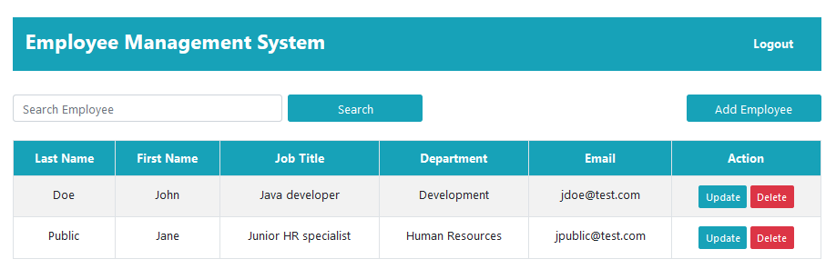

# employee-app
<b>Employee Management application - Spring framework</b>
  
<b>Description:</b>

An employee management application that is used to keep employee data, performing
CRUD operations. It is a new version, based on a previous application of mine.
It is built with the Spring framework. Besides the standard operations, a security
login feature is implemented, using the bcrypt encryption on passwords.

  
<b>Technologies used:</b>
 
<ol>
	<li>Spring Boot</li>
	<li>Spring MVC</li>
	<li>Spring Data JPA</li>
	<li>Spring Security</li>
	<li>Apache Maven</li>
	<li>Thymeleaf</li>
	<li>MySQL database</li>
</ol>

# 

  

	<kbd></kbd>
	  
	<b>Image 1 - Login screen</b>

  
  

	<kbd></kbd>
	  
	<b>Image 2 - List employees</b>

  
  

	<kbd></kbd>
	  
	<b>Image 3 - Add employee</b>

  
  

	<kbd></kbd>
	  
	<b>Image 4 - Update employee</b>

  
  

	<kbd></kbd>
	  
	<b>Image 5 - Delete employee</b>

  
  